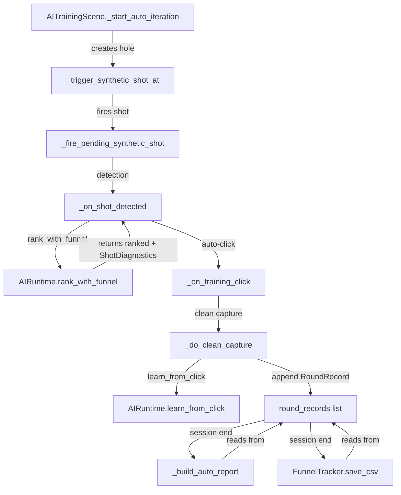

# Design Document: AI Training Observability

## Overview

This feature adds structured observability, unified reporting, and experiment controls to the AI auto-training system. The core change is introducing a `RoundRecord` dataclass as the single source of truth for all per-round metrics, replacing the current scattered `auto_stats` dict and sidecar metadata. All reporting surfaces (on-screen Auto_Report, FunnelTracker summary, CSV export) will derive their numbers exclusively from this list.

Secondary changes include: AI guess pre-facit statistics, round-ID state logging, block-per-100 trend tables, candidate count statistics, a configurable `candidate_limit` setting that flows from `settings.json` through `AIRuntime` to `HitScanner`, and pluggable sampling mode strategies for synthetic hole placement.

### Design Principles

1. **Single source of truth** — One `list[RoundRecord]` drives all outputs. No parallel counters.
2. **Minimal coupling** — New code lives in existing modules. No new files except possibly a small dataclass definition in `diagnostics.py`.
3. **No AI tuning** — This is strictly observability/debug tooling.
4. **Practical over elegant** — Simple dataclass, plain functions, no frameworks.

## Architecture

The data flow during an auto-training session:



### Key Architectural Decisions

**Decision 1: RoundRecord lives in `diagnostics.py`**
Rationale: It's a diagnostics data structure. Keeping it next to `ShotDiagnostics` and `FunnelTracker` avoids circular imports and keeps the diagnostics module self-contained.

**Decision 2: `candidate_limit` flows via AIRuntime property, not direct HitScanner config**
Rationale: HitScanner is a low-level detector that shouldn't read AI settings directly. AIRuntime already observes the scanner via bootstrap monkey-patching. The bootstrap patch will set `hit_scanner.candidate_limit` from `AIRuntime.settings["candidate_limit"]` during `observe_scanner()`.

**Decision 3: Sampling modes are plain functions, not a strategy pattern**
Rationale: Four simple functions that take a viewport `Rect` and return `(x, y)`. A dict maps mode names to functions. No classes, no inheritance.

## Components and Interfaces

### 1. RoundRecord (new dataclass in `diagnostics.py`)

```python
@dataclass
class RoundRecord:
    round_id: int
    timestamp: float

    # Ground truth
    gt_screen_x: float
    gt_screen_y: float
    gt_camera_x: float
    gt_camera_y: float

    # Candidate counts
    candidate_count_raw: int       # from hit_scanner before noise rejection
    candidate_count_ranked: int    # after noise rejection + AI ranking

    # Detection results (existing stats, now stored per-round)
    found: bool                    # any ranked candidate within match_radius
    top1_correct: bool             # rank-1 candidate within match_radius
    top3_correct: bool             # any of top-3 within match_radius
    nearest_dist: float            # distance of nearest ranked candidate to GT

    # AI guess pre-facit (NEW — Requirement 1)
    ai_guess_camera_x: float       # top-1 candidate camera_x before training click
    ai_guess_camera_y: float       # top-1 candidate camera_y before training click
    ai_guess_dist_to_gt: float     # distance from AI guess to GT
    ai_guess_correct: bool         # ai_guess_dist_to_gt <= match_radius

    # Sampling / config context
    sampling_mode: str
    match_radius_px: float
    background_mode: str
```

### 2. Modified AITrainingScene (`ai_training.py`)

Changes:
- Add `self.round_records: list[RoundRecord] = []` — the single source of truth
- Add `self.current_round_id: int = 0` — sequential counter
- Remove `self.auto_stats` dict (replaced by computing from `round_records`)
- Add round-state logging via `_log_round_state(round_id, state_name)`
- Replace `_record_detection_stats()` with `_build_round_record()` that creates and appends a `RoundRecord`
- Replace `_build_auto_report()` to compute all stats from `round_records`
- Add block statistics computation in `_build_auto_report()`
- Add candidate count statistics in `_build_auto_report()`
- Replace `_choose_auto_screen_point()` with sampling mode dispatch

### 3. Modified AIRuntime (`runtime.py`)

Changes:
- Read `candidate_limit` from settings (default 200, clamped 1–2000)
- Read `sampling_mode` from settings (default `"center_bias"`)
- Expose `self.candidate_limit` as a property for bootstrap to read

### 4. Modified HitScanner (`hit_scanner.py`)

Changes:
- Add `self.candidate_limit: int = 200` instance variable
- Replace hardcoded `[:150]` slice with `[:self.candidate_limit]`

### 5. Modified bootstrap.py

Changes:
- In `wrapped_update`, after `runtime.observe_scanner(self)`, set `self.candidate_limit = runtime.candidate_limit`

### 6. Sampling Mode Functions (in `ai_training.py`)

```python
def _sample_center_bias(vp: pygame.Rect, margin: int = 12) -> tuple[int, int]:
    """Current behavior: uniform random within viewport with margin."""
    ...

def _sample_uniform(vp: pygame.Rect, margin: int = 12) -> tuple[int, int]:
    """Uniform random across full viewport."""
    ...

def _sample_edge_bias(vp: pygame.Rect, margin: int = 12) -> tuple[int, int]:
    """>=60% of targets within 15% of viewport edge."""
    ...

def _sample_corners(vp: pygame.Rect, margin: int = 12) -> tuple[int, int]:
    """Distribute evenly across four quadrants, each within 25% of corner."""
    ...

SAMPLING_MODES = {
    "center_bias": _sample_center_bias,
    "uniform": _sample_uniform,
    "edge_bias": _sample_edge_bias,
    "corners": _sample_corners,
}
```

### 7. FunnelTracker CSV Enhancement (`diagnostics.py`)

Changes:
- `save_csv()` accepts an optional `round_records` parameter
- When provided, writes one row per `RoundRecord` with all fields including AI guess pre-facit fields
- Existing per-shot `ShotDiagnostics` data is merged with `RoundRecord` data by matching round_id/index

## Data Models

### RoundRecord Fields

| Field | Type | Source | Description |
|-------|------|--------|-------------|
| `round_id` | int | AITrainingScene counter | Sequential 1-based ID |
| `timestamp` | float | `time.time()` | When round completed |
| `gt_screen_x/y` | float | `auto_target_screen_xy` | Ground truth screen position |
| `gt_camera_x/y` | float | `project_screen_point()` | Ground truth camera position |
| `candidate_count_raw` | int | `len(hit_scanner.last_candidates)` | Raw candidates before funnel |
| `candidate_count_ranked` | int | `len(self.ranked_candidates)` | After noise rejection + ranking |
| `found` | bool | distance check | Any ranked candidate within match_radius |
| `top1_correct` | bool | distance check | Rank-1 within match_radius |
| `top3_correct` | bool | distance check | Any top-3 within match_radius |
| `nearest_dist` | float | `math.hypot()` | Nearest ranked candidate distance to GT |
| `ai_guess_camera_x/y` | float | `ranked_candidates[0]` | AI's top-1 pick before training |
| `ai_guess_dist_to_gt` | float | `math.hypot()` | Distance from AI guess to GT |
| `ai_guess_correct` | bool | distance check | AI guess within match_radius |
| `sampling_mode` | str | `runtime.settings` | Which sampling strategy was used |
| `match_radius_px` | float | `runtime.settings` | Match radius used for this round |
| `background_mode` | str | `MODE_NAMES[bg_mode_index]` | Background mode during round |

### Settings File Additions (`content/ai/settings.json`)

| Key | Type | Default | Range | Description |
|-----|------|---------|-------|-------------|
| `candidate_limit` | int | 200 | 1–2000 | Max raw hotspot candidates retained |
| `sampling_mode` | str | `"center_bias"` | `center_bias\|uniform\|edge_bias\|corners` | Synthetic hole placement strategy |

### Auto Report Structure

The on-screen report will display sections in this order:

1. **Header**: "Autoträning klar" + iteration count
2. **Core stats**: found, top1, top3, missed (computed from `round_records`)
3. **AI Guess stats** (Req 1): ai_guess_correct count/%, avg distance
4. **First-100 vs Last-100 comparison** (Req 1.4, only if ≥200 rounds)
5. **Candidate count stats** (Req 5): avg, min, max, zero-count, >50/>100/>200 counts
6. **Block statistics table** (Req 4, only if >100 rounds): per-100 breakdown
7. **Funnel diagnostics summary** (existing)
8. **CSV path** (existing)


## Correctness Properties

*A property is a characteristic or behavior that should hold true across all valid executions of a system — essentially, a formal statement about what the system should do. Properties serve as the bridge between human-readable specifications and machine-verifiable correctness guarantees.*

### Property 1: Count-based report statistics match RoundRecord aggregation

*For any* list of RoundRecords, the report's `found` count SHALL equal the number of records where `found=True`, the `top1` count SHALL equal the number where `top1_correct=True`, the `top3` count SHALL equal the number where `top3_correct=True`, and the `ai_guess_correct` count SHALL equal the number where `ai_guess_correct=True`. Each corresponding percentage SHALL equal `count / len(records) * 100`.

**Validates: Requirements 1.1, 1.2, 2.2**

### Property 2: Average AI guess distance computation

*For any* list of RoundRecords where at least one record has `candidate_count_ranked > 0`, the reported `ai_guess_avg_dist_to_gt` SHALL equal the mean of `ai_guess_dist_to_gt` over only those records with `candidate_count_ranked > 0`. When no records have candidates, the average SHALL be reported as `0.0` or `n/a`.

**Validates: Requirements 1.3**

### Property 3: First-100 vs last-100 comparison presence and correctness

*For any* list of RoundRecords, the first/last-100 comparison section SHALL be present if and only if `len(records) >= 200`. When present, the first-100 stats SHALL be computed from `records[0:100]` and the last-100 stats SHALL be computed from `records[-100:]`, and each stat SHALL match independent computation over the respective slice.

**Validates: Requirements 1.4, 1.5**

### Property 4: CSV export round-trip preserves all RoundRecord fields

*For any* list of RoundRecords, exporting to CSV and parsing the CSV back SHALL produce the same number of rows as records, and each row SHALL contain all RoundRecord fields including `ai_guess_correct`, `ai_guess_dist_to_gt`, `candidate_count_raw`, and `candidate_count_ranked`.

**Validates: Requirements 2.4, 2.5**

### Property 5: Sequential round IDs

*For any* auto-training session of N rounds, the `round_id` values in the RoundRecord list SHALL form the sequence `[1, 2, 3, ..., N]` with no gaps, no duplicates, and starting at 1.

**Validates: Requirements 3.1**

### Property 6: Block statistics correctness

*For any* list of RoundRecords, the block statistics table SHALL be present if and only if `len(records) > 100`. When present, the number of blocks SHALL equal `ceil(len(records) / 100)`, the last block SHALL contain `len(records) % 100` records (or 100 if evenly divisible), and each block's `found`, `top1`, `top3`, `ai_guess_correct` counts and `avg_dist` SHALL match independent computation over the corresponding slice of records.

**Validates: Requirements 4.1, 4.2, 4.3, 4.4**

### Property 7: Candidate count statistics correctness

*For any* list of RoundRecords, the reported average candidate count SHALL equal `sum(r.candidate_count_raw for r in records) / len(records)`, the min SHALL equal `min(r.candidate_count_raw)`, the max SHALL equal `max(r.candidate_count_raw)`, the zero-candidate count SHALL equal the number of records where `candidate_count_raw == 0`, and the >50, >100, >200 threshold counts SHALL each equal the number of records exceeding the respective threshold.

**Validates: Requirements 5.1, 5.2, 5.3, 5.4**

### Property 8: Candidate limit clamping

*For any* integer value, when used as `candidate_limit`, the effective value SHALL be clamped to the range `[1, 2000]`. Values less than 1 SHALL become 1, values greater than 2000 SHALL become 2000, and values within range SHALL be unchanged.

**Validates: Requirements 6.5, 6.6**

### Property 9: Sampling modes produce valid viewport points

*For any* viewport rectangle and any recognized sampling mode (`center_bias`, `uniform`, `edge_bias`, `corners`), every generated point SHALL fall within the viewport bounds. For `center_bias` and `uniform`, every point SHALL additionally respect the 12-pixel margin from viewport edges.

**Validates: Requirements 7.3, 7.4**

### Property 10: Edge bias sampling distribution

*For any* viewport rectangle, when using `edge_bias` sampling mode over 200 or more samples, at least 60% of generated points SHALL fall within 15% of the viewport edge distance from any edge.

**Validates: Requirements 7.5**

### Property 11: Corners sampling distribution

*For any* viewport rectangle, when using `corners` sampling mode over 200 or more samples, points SHALL be distributed across all four quadrants of the viewport, and each point SHALL fall within 25% of the viewport dimensions from its respective corner.

**Validates: Requirements 7.6**

### Property 12: Unrecognized sampling mode fallback

*For any* string that is not one of the recognized sampling mode names, the sampling function SHALL fall back to `center_bias` behavior, producing points within the viewport with a 12-pixel margin.

**Validates: Requirements 7.7**

## Error Handling

### Settings Loading Errors

- If `settings.json` is missing or malformed, `AIRuntime` already falls back to `DEFAULT_SETTINGS`. The new keys (`candidate_limit`, `sampling_mode`) follow the same pattern with their own defaults.
- If `candidate_limit` is not an integer (e.g., a string or float), it will be cast via `int()` with a try/except falling back to 200.
- If `sampling_mode` is an unrecognized string, a warning is logged to stdout and `center_bias` is used.

### Round Record Consistency

- At session end, if `len(round_records) != current_round_id` or `len(round_records) != len(funnel.shots)`, a `[MISMATCH]` warning is logged with all three values. The report is still generated from `round_records` (the authoritative source).
- If a round has zero candidates (shot detected but nothing found), a `RoundRecord` is still created with `candidate_count_raw=0`, `found=False`, and sentinel values for AI guess fields (`ai_guess_dist_to_gt=9999.0`, `ai_guess_correct=False`).

### CSV Export Errors

- If the `content/ai/reports/` directory cannot be created, the CSV export fails silently (existing behavior) and the report still displays on screen.
- If a `RoundRecord` field is missing or corrupt, the CSV writer uses `extrasaction="ignore"` and writes what it can.

### Sampling Mode Edge Cases

- If the viewport is smaller than `2 * margin` in either dimension, sampling functions clamp to the viewport center to avoid invalid ranges.
- `corners` mode with a very small viewport (< 50px) degenerates to center sampling.

## Testing Strategy

### Property-Based Tests

The feature is well-suited for property-based testing because the core logic involves:
- Pure aggregation functions over lists of dataclass instances (report stats, block stats, candidate stats)
- Clamping/validation of numeric inputs (candidate_limit)
- Spatial distribution verification (sampling modes)

**Library**: [Hypothesis](https://hypothesis.readthedocs.io/) (Python PBT library)
**Configuration**: Minimum 100 examples per property test
**Tag format**: `# Feature: ai-training-observability, Property {N}: {title}`

Each correctness property (1–12) maps to one property-based test. Generators will produce:
- Random `RoundRecord` lists with realistic field ranges
- Random integers for candidate_limit clamping
- Random `pygame.Rect` viewports for sampling mode tests

### Unit Tests (Example-Based)

- **RoundRecord creation**: Verify dataclass fields are accessible and have correct types
- **Settings loading**: Verify `candidate_limit` and `sampling_mode` are read from settings.json with correct defaults
- **CSV field presence**: Verify specific columns exist in exported CSV
- **Log format**: Verify `[ROUND {id}] {state}` format in captured stdout
- **Mismatch warning**: Simulate count divergence and verify `[MISMATCH]` log

### Integration Tests

- **End-to-end auto-training session** (manual): Run 10-round auto-training, verify report displays, CSV is written, and all counts match
- **candidate_limit flow**: Set `candidate_limit=50` in settings.json, run detection, verify `hit_scanner.last_candidates` length ≤ 50
- **Bootstrap patching**: Verify `hit_scanner.candidate_limit` is updated after `observe_scanner()` call
